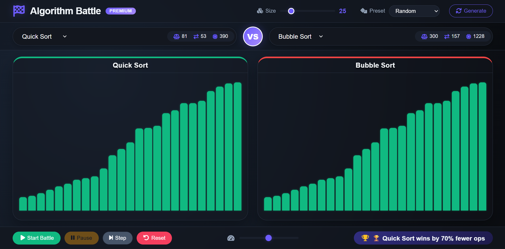

# ⚔️ Algorithm Battle Simulator

**A Premium Side-by-Side Sorting Algorithm Comparison Tool**


---

## 📸 Preview



> Side-by-side visualization of sorting algorithms with real-time metrics

---

## 📌 Project Overview

**Algorithm Battle Simulator** is a web-based tool that allows two sorting algorithms to compete in real time on the same dataset.

It transforms theoretical concepts like **time complexity** into a visual, measurable experience by displaying how algorithms behave step-by-step.

---

## 🎯 Motivation

* Understand how sorting algorithms behave internally
* Compare **O(n²)** vs **O(n log n)** in real time
* Visualize operations like comparisons and swaps
* Build strong DSA intuition

---

## ✨ Features

* ⚔️ Side-by-side algorithm comparison
* 📊 Real-time performance metrics
* 🎛 Adjustable array size & speed
* ⏯ Play / Pause / Reset controls
* 🎨 Clean dark UI design
* ⚡ Smooth animations

---

## 🧠 Algorithms Included

* Bubble Sort
* Insertion Sort
* Selection Sort
* Quick Sort
* Merge Sort

---

## 📊 Performance Metrics

Each algorithm is evaluated using:

* **Comparisons** → Number of element comparisons
* **Swaps** → Number of element swaps
* **Array Accesses** → Read/write operations

### 🏆 Winner Logic

The simulator determines the winner based on overall efficiency:

* Fewer operations = Better performance
* Faster completion = Higher score

---

## 🏗 System Architecture

```text
┌───────────────────────────────┐
│         WEB BROWSER           │
│                               │
│  index.html (Structure)       │
│  style.css  (Styling)         │
│  script.js (Logic)            │
│              │
│  Fetch API (POST /run)
└──────────────▼────────────────┘
               │
               ▼
┌───────────────────────────────┐
│        FLASK SERVER           │
│                               │
│  app.py                       │
│  - Sorting algorithms         │
│  - Step generator             │
│  - /run endpoint              │
│                               │
└──────────────▼────────────────┘
               │
               ▼
      JSON Response (Steps + Stats)
               │
               ▼
┌───────────────────────────────┐
│     FRONTEND ANIMATION        │
│  (Real-time visualization)    │
└───────────────────────────────┘
```

---

## 📁 Project Structure

```text
algorithm-battle/
├── app.py
├── index.html
├── style.css
├── script.js
├── requirements.txt
├── screenshot.png
└── README.md
```

---

## ⚙️ How It Works

1. User selects two algorithms
2. Generates array
3. Frontend sends request to backend
4. Backend runs both algorithms
5. Returns step-by-step execution data
6. Frontend animates both simultaneously

---

## ▶️ Setup & Installation

```bash
pip install -r requirements.txt
python app.py
```

Open in browser:

```
http://127.0.0.1:5000/
```

---

## 🚀 Future Enhancements

* Add Heap Sort & Radix Sort
* Graph-based performance charts
* Export results as report
* Sound-based visualization

---

## 📜 License

MIT License

---

## 👨‍💻 Author

**Uday Sri**
🔗 https://github.com/Udaysri2025
